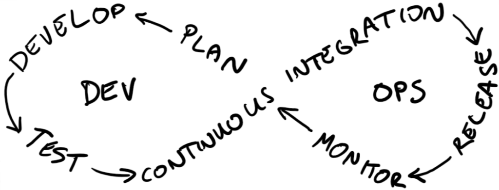
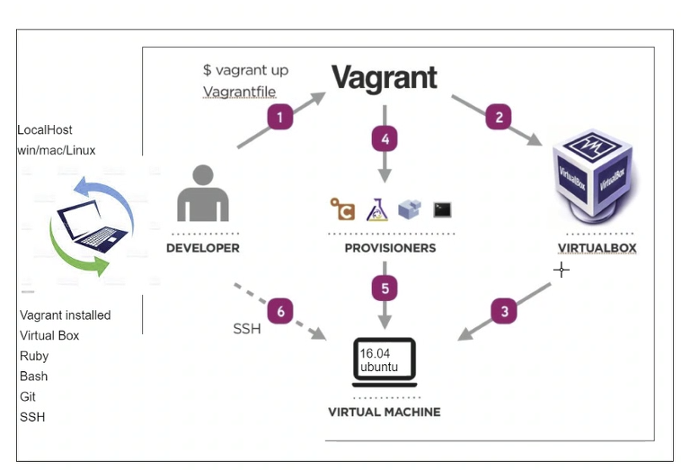

# My repository for my DevOps work 

# What is DevOps
It's an approach, its a set of technical and operational practices that have automation at its center. Similar to agile, It looks to streamline the software development cycle between the development and operations teams through continuous integration.

What that means is businesses can reduce software failures while also providing faster security updates and software patches.

Devops come about to answer the concerns that come between two diffferent teams. To allow for smoother communication and a reduction on blame culture.

# The four pillers of Devops
Ease of usibility - it allows for non developers to be able understand and interpret code

Robustness - solutions are delivered quickly and fixes made have immediate affect, there should be no downtime

Flexibility - can work on any program or software without having too much trouble to accomodate for it

Cost - bottom line, saves money for the company, whether this is through the previous three pillers or in any other way

# The role of a DevOps engineer 
Essentially a devops engineer works between the development and operations teams. They manage the operations of software development by implementing 
engineering tools such as Git, Ansible, Jenkins.

They also supervise code changes and have the skills to help to design, develop, test and release software if required.

The qualities required for Devops consultant:

 

# Development enviroment
An development environment in software and web development is a workspace for developers to make changes without breaking anything in a live environment. 

# Vagrant 
We are using Vagrant to create a Linux (ubunto) environment by using VirtualBox to handle the creation of the Virtual Machine (VM). 

# Pre-requisites
Before progressing to install the virtual environment there are some dependencies you will need to download before running any scripts. These are:

Vargrant (version 2.2.16 or later ) - Vagrant is a tool for building and managing virtual machine environments and helps lower environment setup time.

VirtualBox (version 6.0.24) - Virtual box is the underlying software that will allow you to create virtual environments on your local laptop or desktop.

How vagrant works with ubunto to give us the enviroment

# Setting up your Linux environment
To set up vagrant type `vagrant init` in the desired root folder. This will create a vagrantfile that'll need editing to have the following commands only:

`Vagrant.configure("2") do |config|`

 `config.vm.box = "ubuntu/xenial64"`

 `# Add a private network between local host & VM using IP`
 `config.vm.network "private_network", ip: "192.168.10.100"`

`end`

Now you are in the root project folder type `vagrant up` - You will see your environment build begin. Once the build has completed you can log into the environment using the command `vagrant ssh`. You will see a new terminal which will relate to your virtual linux environment.

- To exit our vagrant Linux environment simply type `exit` and hit enter
- `vagrant destroy`will completely remove your environment giving you the option to completely delete backup folder/files as well.

#### Most used commands
- update and upgrade ubuntu `sudo apt-get update -y`
- upgrade `sudo apt-get upgrade -y`
- install nginx `sudo apt-get install nginx -y`
- check nginx status `systemctl status ngnix` or `stop` or `start` or `restart`
- who am i `uname` or `uname -a`
- where am i `pwd`
- how to createa folder in linux `mkdir dir-name`
- how to check folder/files `ls` or `ls -a/la`
- change dir `cd name-dir`
- come out/back from the current location `cd..`
- how to create a file `touch filename` or `nano filename`
- move file from currect location to a folder `
- cut paste or move, `mv test.txt devops`, similarly `cp` to copy

- 

#### file permisions
- read `r` write `w` and execute `x`
- to check file permisions `-l`
- change permisions `chmod permision filename`
- Alternatively change permissions using chmod Absolute Mode

• Uses octal numbers. 
- 4 = read 
- 2 = write 
- 1 = execute 
• Add numbers of permissions you wish to grant. 
- Sum of these is what you provide. 
- Read, write, execute is 7 (4 + 2 + 1). 
- Read, write is 6 (4 + 2). 
• Complete permissions are expressed as three-digit number. 
- Each digit corresponds to a context (owner, group, other).
• E.g. chmod 764 file1 (user = rwx, group = rw and others = read on file1)
           chmod 700 file1 (user = rwx)
           chmod 640 file1 (user = rw, group = r)

